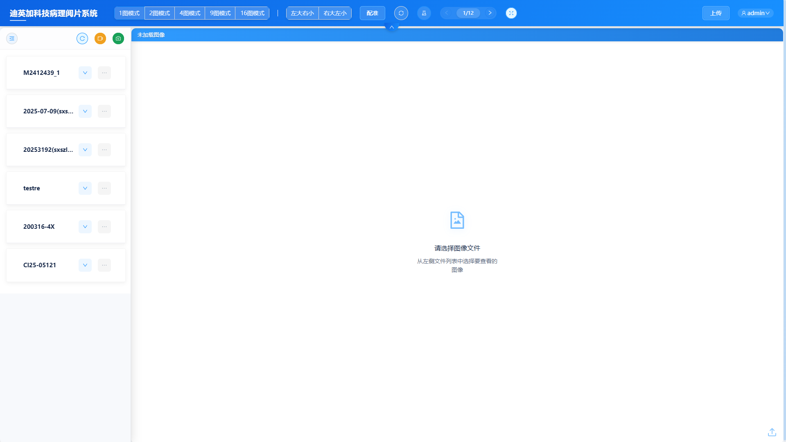
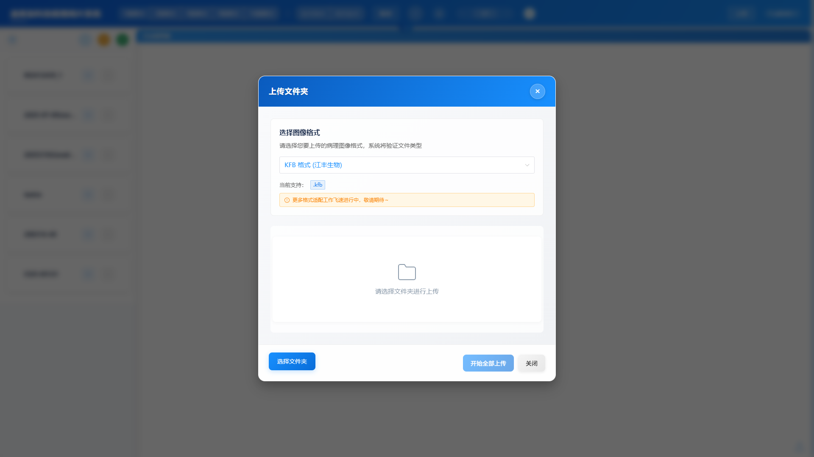
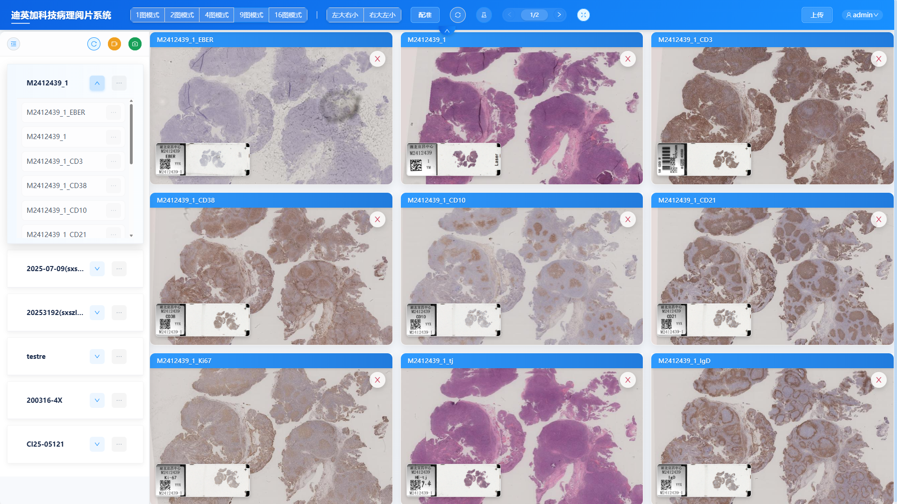
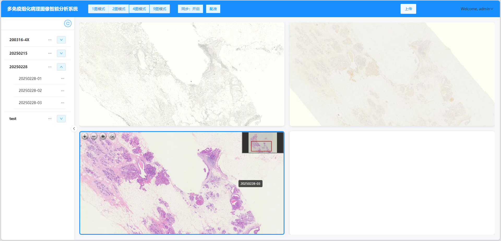
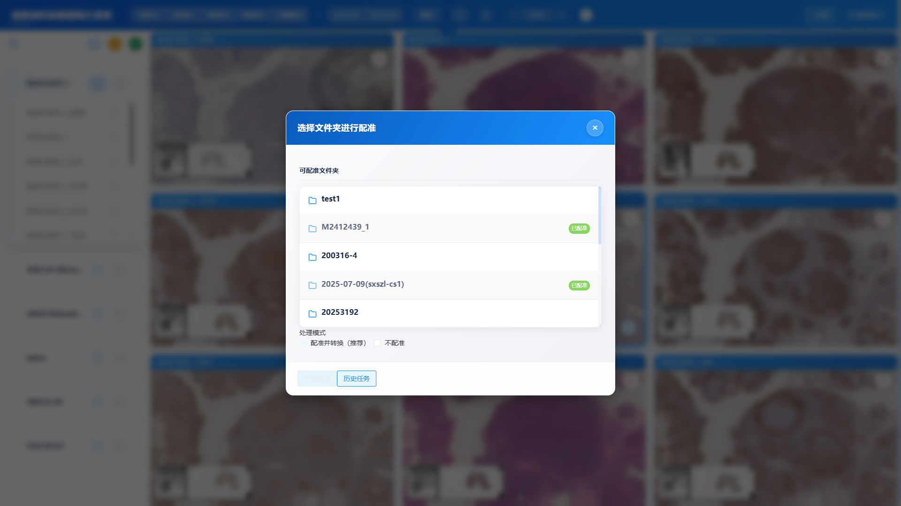
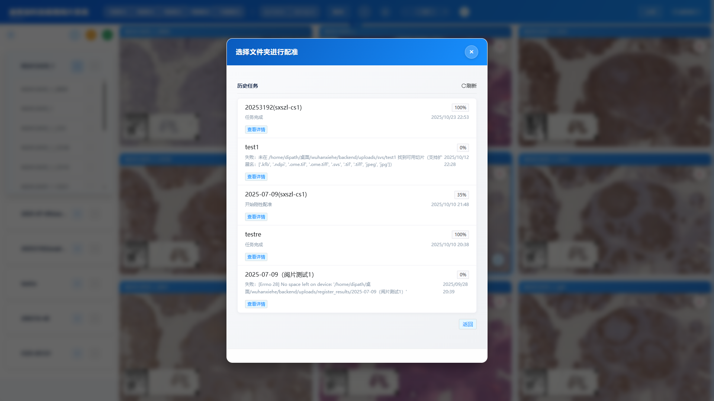
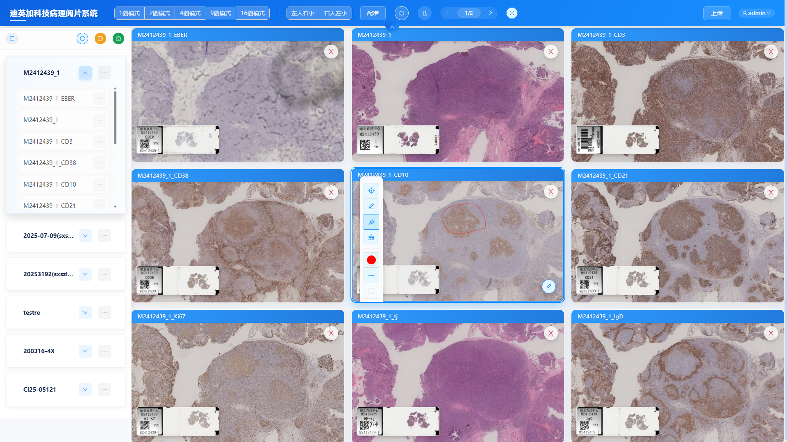
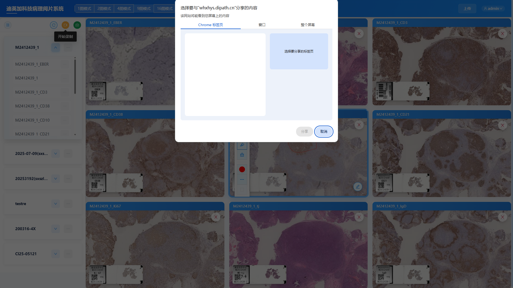

# 🔬 医学病理影像分析系统

> 基于 Vue 3 的专业病理图像查看与标注平台

医学病理影像分析系统是一个专业的病理切片图像查看与分析平台，支持超大图像（Whole Slide Image, WSI）的在线浏览、多视图对比、图像配准、智能标注以及屏幕录制等功能。系统采用现代化的前端架构，为病理医生提供高效、便捷的阅片与诊断工具。

---

## ✨ 核心功能

### 📂 文件管理

#### 1. 批量上传
- **多格式支持**：SVS、TIFF、NDPI、VMS、SCN、MRXS、BIF、CZI、LSM、QPTIFF、JPG/JPEG、KFB 等主流病理切片格式
- **文件类型预选**：上传前选择文件格式，自动过滤不符合的文件
- **批量队列上传**：支持选择多个文件夹，按序列自动上传
- **实时进度跟踪**：
  - 上传进度百分比显示
  - 已上传大小 / 总大小实时更新
  - 队列状态监控（排队中、上传中、成功、失败）
- **失败重试机制**：
  - 自动重试最多 3 次
  - 指数退避策略（2s → 4s → 8s）
  - 防止单个失败阻塞整个队列

#### 2. 上传后处理选项
- **灵活配准选择**：上传成功后弹出引导框，选择：
  - **配准并转换**：自动进行图像配准和 DZI 转换
  - **仅转换为 DZI**：跳过配准，直接转换为可浏览格式
- **任务状态跟踪**：实时显示配准/转换进度
- **自动展示**：处理完成后自动展开文件夹并显示图像

#### 3. 目录管理
- **文件夹操作**：
  - 展开/收起文件夹
  - 删除整个文件夹
  - 一键展示文件夹内所有图像
- **文件操作**：
  - 单个文件删除
  - 文件重命名
  - 单击选择加载到查看器
- **智能刷新**：支持手动刷新文件列表

---

### 🖼️ 图像展示与查看

#### 1. 多种布局模式
- **标准布局**：1、2、4、9、16 图模式
- **特殊布局**：
  - **左大右小（1+4）**：左侧 1 个大图，右侧 4 个小图
  - **右大左小（4+1）**：左侧 4 个小图，右侧 1 个大图
- **动态切换**：实时切换布局，图像自动适配

#### 2. 高性能图像浏览
- **基于 OpenSeadragon**：
  - 支持超大病理切片（GB 级别）流畅浏览
  - 无损缩放（最大 200%）
  - 平滑平移
  - 双指/鼠标滚轮缩放
- **DZI 格式**：Deep Zoom Image 金字塔瓦片技术，按需加载
- **硬件加速**：WebGL 渲染（前 7 个视图），Canvas 降级

#### 3. 图像翻页与分页
- **智能分页**：
  - 根据当前布局自动计算每页显示数量
  - 页码显示：当前页 / 总页数
  - 上一页/下一页按钮
- **拖动打开新窗口**：
  - **拖动翻页按钮**：拖动"上一页"或"下一页"按钮到新标签页，自动在新窗口展示对应页的多图
  - **拖动单张图片**：拖动任意图片到新标签页，新窗口以单图模式展示该图片
  - **适用场景**：双屏协同诊断，一个屏幕查看一组图片，另一个屏幕查看单张图片细节

#### 4. 视图同步
- **缩放同步**：所有视图保持相同缩放级别
- **平移同步**：所有视图同步移动，对比相同区域
- **一键切换**：顶部同步按钮快速开启/关闭

#### 5. 扫描信息图
- **自动叠加显示**：每张图片左下角显示扫描时的元数据图
- **动态调整大小**：
  - 标准视图：宽度 `clamp(200px, 28%, 480px)`
  - 小视图：宽度 `clamp(140px, 35%, 360px)`
- **开关控制**：顶部按钮一键显示/隐藏

---

### 🎨 图像标注与工具

#### 1. 标注模式
- **进入/退出标注**：点击右下角画笔按钮切换
- **仅对选中视图生效**：点击视图激活后才可标注

#### 2. 标注工具箱
- **选择工具（Select）**：
  - 选中标注对象
  - 移动、缩放、旋转标注
  - 删除选中标注
- **自由画笔（Pencil）**：
  - 自由手绘线条
  - 支持调节线宽（0.5px - 10px）
  - 支持颜色选择（红、蓝、绿、黄、黑）
- **直线工具（Line）**：绘制直线段
- **矩形工具（Rectangle）**：绘制矩形框，标记感兴趣区域（ROI）
- **圆形工具（Circle）**：绘制圆形/椭圆
- **橡皮擦（Eraser）**：
  - 擦除标注内容
  - 可调节橡皮擦大小（10px - 50px）

#### 3. 标注数据管理
- **标注同步**：开启后，在一个视图的标注自动同步到其他视图
- **标注导出**：将标注数据保存为 JSON 格式
- **标注导入**：加载已保存的标注数据
- **清空标注**：一键清除当前视图的所有标注

---

### 🔄 图像配准与处理

#### 1. 配准功能
- **手动配准**：
  - 点击"配准"按钮打开配准模态框
  - 选择需要配准的文件夹
  - 选择模式：
    - **配准并转换**：对图像进行几何对齐后转换为 DZI
    - **仅渲染（不配准）**：跳过配准，直接转换为 DZI
- **自动配准**：上传成功后通过引导框自动触发

#### 2. 任务进度监控
- **实时进度显示**：
  - 进度百分比
  - 已处理文件数 / 总文件数
  - 任务状态（待处理、处理中、已完成、失败）
  - 剩余时间估算
- **历史任务查询**：
  - 查看所有历史配准任务
  - 任务详情展示
  - 查看任务结果
- **后台轮询**：
  - 每 30 秒自动检查活跃任务状态
  - 任务完成自动通知
  - 失败任务自动清理

#### 3. 错误处理
- **任务失败重试**：可重新发起配准
- **本地任务清理**：自动清除无效/过期任务
- **错误提示**：详细的失败原因说明

---

### 🎥 录屏与多视图截图

#### 1. 屏幕录制
- **侧边栏录制按钮**：
  - 开始录制：录制当前整个应用界面
  - 实时显示录制时长（格式：`MM:SS`）
  - 停止录制：自动保存为 WebM 视频文件
- **基于 RecordRTC**：高质量屏幕录制
- **适用场景**：
  - 制作病理教学视频
  - 记录诊断过程
  - 远程会诊演示

#### 2. 多视图截图
- **一键截图**：保存当前所有视图的整体布局
- **高清输出**：基于 html2canvas 生成高清图片
- **自动下载**：截图自动保存到本地

---

### 🖥️ 用户界面与交互

#### 1. 全屏查看模式
- **一键全屏**：点击全屏按钮同时隐藏：
  - 顶部导航栏
  - 左侧文件目录
- **最大化查看区域**：适合双屏阅片场景
- **快速恢复**：再次点击恢复正常布局

#### 2. 侧边栏控制
- **折叠/展开**：侧边栏可独立折叠，宽度 320px ↔ 64px
- **滚动优化**：文件列表支持平滑滚动
- **操作菜单**：右键菜单快速访问常用操作

#### 3. 响应式设计
- **自适应布局**：根据屏幕大小自动调整
- **优雅降级**：在不同设备上保持良好体验

#### 4. 图像标题栏
- **文件名显示**：每个视图顶部显示当前加载的图像文件名
- **关闭按钮**：右上角快速关闭图像

---

### 🔐 用户认证与权限

#### 1. 登录系统
- **用户名/密码登录**
- **Token 持久化**：登录状态保存到 `localStorage`
- **自动跳转**：登录后跳转到分析页面

#### 2. 权限管理
- **路由守卫**：未登录自动跳转到登录页
- **Token 过期处理**：自动提示并跳转登录
- **用户信息展示**：顶部显示当前登录用户名

#### 3. 退出登录
- **一键退出**：清除本地 Token 和用户数据
- **安全跳转**：自动返回登录页

---

### 📋 操作说明

#### 内置操作手册
- **按钮位置**：用户菜单 → 操作说明
- **详细文档**：系统使用指南（PDF 格式）
- **在线查看**：弹窗内直接阅读

---

## 🛠️ 技术栈

### 前端框架
- **Vue 3.4**：渐进式 JavaScript 框架
- **Composition API**：更灵活的组件逻辑组织
- **Vue Router 4.2**：单页应用路由管理
- **Pinia 2.1**：轻量级状态管理库

### UI 组件库
- **Naive UI 2.38**：
  - 美观的组件设计
  - TypeScript 支持
  - 按需引入优化
  - 丰富的交互组件（Button、Modal、List、Dropdown、Tooltip、Progress 等）

### 图像处理
- **OpenSeadragon 5.0**：
  - Deep Zoom Image (DZI) 支持
  - 高性能瓦片加载
  - WebGL 硬件加速渲染
- **Fabric.js 5.3**：
  - Canvas 图形库
  - 标注工具实现
  - 对象交互（选择、移动、旋转、缩放）
- **openseadragon-fabricjs-overlay**：OpenSeadragon 与 Fabric.js 集成

### 工具库
- **Axios 1.7**：HTTP 请求库
- **html2canvas 1.4**：网页截图
- **RecordRTC 5.6**：屏幕录制
- **XLSX 0.18**：Excel 文件导出

### 构建工具
- **Vite 5.0**：
  - 极速冷启动
  - HMR（热模块替换）
  - 原生 ES 模块支持
  - 生产环境优化打包

---

## 📦 项目结构

```
MedImageAnalyzer/
├── public/                      # 静态资源
│   ├── imgs/                    # 图片资源
│   ├── js/                      # 第三方 JS 库
│   │   ├── fabric.min.js
│   │   ├── openseadragon.min.js
│   │   └── openseadragon-fabricjs-overlay.js
│   └── openseadragon-bin/       # OpenSeadragon 控件图标
├── src/
│   ├── components/              # Vue 组件
│   │   ├── FabricCanvas.vue           # Fabric.js 画布组件
│   │   ├── FabricOverlayCanvas.vue    # 标注叠加层组件
│   │   ├── FileExplorerComponent.vue  # 文件浏览器组件
│   │   ├── HeaderComponent.vue        # 顶部导航组件
│   │   ├── ImageToolbox.vue           # 标注工具箱组件
│   │   ├── ModalComponent.vue         # 模态框组件（上传/配准）
│   │   ├── RegistrationProgress.vue   # 配准进度组件
│   │   └── ViewerComponent.vue        # 图像查看器组件
│   ├── views/                   # 页面视图
│   │   ├── AnalysisView.vue           # 分析主页面
│   │   └── LoginView.vue              # 登录页面
│   ├── stores/                  # Pinia 状态管理
│   │   ├── user.js                    # 用户状态
│   │   └── viewer.js                  # 查看器状态
│   ├── services/                # API 服务
│   │   ├── api.js                     # HTTP 请求封装
│   │   └── registrationService.js    # 配准服务
│   ├── utils/                   # 工具函数
│   │   ├── debounce.js                # 防抖函数
│   │   └── throttle.js                # 节流函数
│   ├── router/                  # 路由配置
│   │   └── index.js
│   ├── App.vue                  # 根组件
│   └── main.js                  # 应用入口
├── imgs/                        # README 截图
├── vite.config.js               # Vite 配置
├── package.json                 # 项目依赖
└── README.md                    # 项目文档
```

---

## 🚀 快速开始

### 环境要求
- **Node.js**：>= 16.0.0
- **npm**：>= 8.0.0 或 **yarn**：>= 1.22.0

### 安装依赖
```bash
npm install
# 或
yarn install
```

### 开发模式
```bash
npm run dev
# 或
yarn dev
```
启动后访问：`http://localhost:5173`

### 生产构建
```bash
npm run build
# 或
yarn build
```
构建产物输出到 `dist/` 目录

### 预览生产构建
```bash
npm run preview
# 或
yarn preview
```

---

## 🔧 配置说明

### 后端 API 配置
编辑 `vite.config.js` 中的代理配置：

```javascript
export default defineConfig({
  server: {
    proxy: {
      '/api': {
        target: 'http://your-backend-server:8080',
        changeOrigin: true
      }
    }
  }
})
```

### 环境变量
创建 `.env.local` 文件：

```env
VITE_API_BASE_URL=http://localhost:8080
VITE_APP_TITLE=医学病理影像分析系统
```

---

## 📸 功能截图

### 主界面

*多图模式展示，支持同步缩放平移*

### 文件上传

*批量队列上传，支持多格式、实时进度跟踪*

### 文件列表与图像展示

*左侧文件夹树形结构，右侧多视图展示*

### 图像查看

*高性能 DZI 图像浏览，支持无损缩放*

### 配准功能

*配准模态框，选择文件夹和处理模式*


*实时监控配准进度，显示处理状态和剩余时间*

### 图像标注

*丰富的标注工具，支持多种图形和自由绘制*

### 屏幕录制

*一键录制阅片过程，自动保存为视频*

---

## 🎯 使用场景

### 1. 病理切片阅片
- 超大病理切片（WSI）的在线浏览
- 多视图对比诊断
- 双屏协同阅片
- 拖动图片到新窗口独立查看

### 2. 图像配准与对齐
- 不同染色方式的切片对齐
- 连续切片的空间配准
- 批量图像自动配准
- 配准后多视图对比

### 3. 图像标注与 ROI 标记
- 标记感兴趣区域（ROI）
- 测量长度、面积
- 导出标注数据供算法训练
- 标注同步功能辅助批量标注

### 4. 教学与会诊
- 屏幕录制制作病理教学视频
- 标注关键病理特征
- 远程会诊讨论
- 多视图截图保存诊断结果

### 5. 科研与数据分析
- 图像数据管理
- 标注数据导出
- 批量处理大规模样本
- 配准后的图像融合分析

---

## 🔐 Nginx 部署配置

### 大文件上传配置
```nginx
server {
    listen 80;
    server_name your-domain.com;
    
    # 最大上传文件大小：50GB
    client_max_body_size 50G;
    # 上传超时时间：6小时
    client_body_timeout 21600s;
    
    location ^~ /api/ {
        # CORS 配置
        if ($request_method = OPTIONS) {
            add_header Access-Control-Allow-Origin "$http_origin" always;
            add_header Access-Control-Allow-Methods "GET, POST, OPTIONS" always;
            add_header Access-Control-Allow-Headers "Content-Type, Authorization" always;
            add_header Access-Control-Allow-Credentials "true" always;
            add_header Access-Control-Max-Age "3600" always;
            return 204;
        }
        
        add_header Access-Control-Allow-Origin "$http_origin" always;
        add_header Access-Control-Allow-Methods "GET, POST, OPTIONS" always;
        add_header Access-Control-Allow-Headers "Content-Type, Authorization" always;
        add_header Access-Control-Allow-Credentials "true" always;
        
        # 代理到后端
        proxy_pass http://127.0.0.1:8080;
        proxy_http_version 1.1;
        proxy_set_header Host $host;
        proxy_set_header X-Real-IP $remote_addr;
        proxy_set_header X-Forwarded-For $proxy_add_x_forwarded_for;
        proxy_set_header Connection "";
        
        # 代理超时配置
        proxy_send_timeout 21600s;
        proxy_read_timeout 21600s;
        proxy_request_buffering off;
        proxy_buffering off;
    }
    
    # 前端静态资源
    root /var/www/html;
    index index.html;
    
    location / {
        try_files $uri $uri/ /index.html;
    }
}
```

---

## 🐛 常见问题

### 1. 图像加载失败
- **检查网络连接**：确保能访问后端 API
- **检查文件格式**：确认已转换为 DZI 格式
- **清除浏览器缓存**：尝试强制刷新（Ctrl+Shift+R）

### 2. 上传失败 413 错误
- **Nginx 配置**：增加 `client_max_body_size`
- **Spring Boot 配置**：增加 `spring.servlet.multipart.max-file-size`
- **检查网络稳定性**：大文件上传需要稳定的网络连接

### 3. 配准任务卡住
- **检查后端服务**：确认配准服务正常运行
- **清除本地缓存**：删除 `localStorage` 中的 `registration_tasks`
- **手动刷新**：点击刷新按钮重新获取任务状态

### 4. 标注无法绘制
- **检查标注模式**：确认已点击画笔按钮进入标注模式
- **检查视图选中**：确认已点击选中目标视图（蓝色边框）
- **工具选择**：确保已选择具体的标注工具（画笔、矩形等）

### 5. 录屏功能不工作
- **浏览器权限**：确认已授予屏幕录制权限
- **浏览器兼容性**：推荐使用 Chrome、Edge 等现代浏览器
- **系统资源**：确保有足够的内存和 CPU 资源

---

## 💡 最佳实践

### 1. 文件管理
- 使用有意义的文件夹命名，方便后续查找
- 定期清理不需要的文件，节省存储空间
- 上传前检查文件格式，避免不必要的错误

### 2. 图像查看
- 使用合适的布局模式，根据对比需求选择 2 图、4 图或 9 图
- 开启同步功能进行多图对比
- 利用拖动新窗口功能实现双屏阅片

### 3. 标注工作
- 标注前先开启标注同步，提高效率
- 定期保存标注数据，避免丢失
- 使用不同颜色区分不同类型的标注

### 4. 配准处理
- 对于不需要配准的图像，选择"仅渲染"模式，节省时间
- 批量上传时合理规划，避免同时处理过多任务
- 定期查看配准进度，及时处理失败任务

---

## 📄 许可证

本项目仅供学习和研究使用。

---

## 👥 贡献者

感谢所有为本项目做出贡献的开发者！

---

## 📞 联系方式

如有问题或建议，请联系项目维护者。

---

**Built with ❤️ by 迪英加科技**
